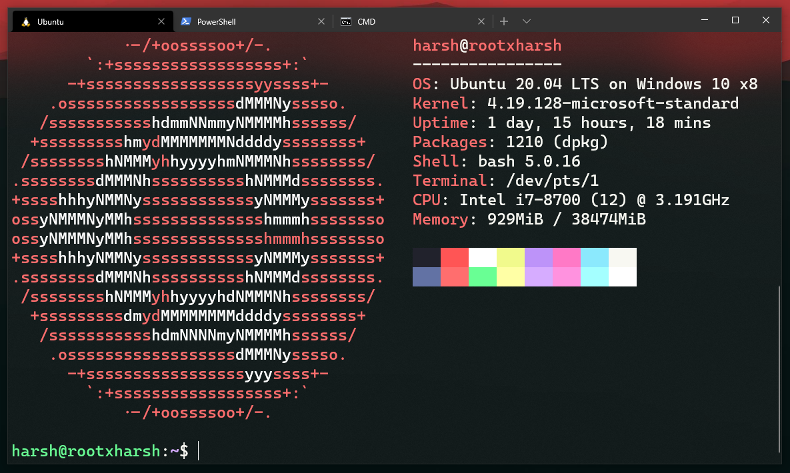

## Because I like WSL 2 and Windows Terminal.



```json
{
            "name": "NiceColorScheme",
            "cursorColor": "#F8F8F2",
            "selectionBackground": "#44475A",
            "foreground": "#F8F8F2",
            "black": "#21222C",
            "blue": "#BD93F9",
            "cyan": "#8BE9FD",
            "green": "#FFFFFF",
            "purple": "#FF79C6",
            "red": "#FF5555",
            "white": "#F8F8F2",
            "yellow": "#F1FA8C",
            "brightBlack": "#6272A4",
            "brightBlue": "#D6ACFF",
            "brightCyan": "#A4FFFF",
            "brightGreen": "#69FF94",
            "brightPurple": "#FF92DF",
            "brightRed": "#FF6E6E",
            "brightWhite": "#FFFFFF",
            "brightYellow": "#FFFFA5"
        },
```

```json
            {
                "guid": "{xxx}",
                "hidden": false,
                "name": "Ubuntu",
                "useAcrylic": true,
                "acrylicOpacity": 0.4,
                "source": "Windows.Terminal.Wsl",
                "colorScheme": "NiceColorScheme",
                "fontSize": 18,
                "cursorColor" : "#FFFFFF",
                "fontFace" : "Cascadia Code",
                "padding" : "5, 5, 5, 5",
                "suppressApplicationTitle": true,
                "tabTitle": "Ubuntu",
                "startingDirectory" : "//wsl$/Ubuntu-20.04/home/harsh"
            }
```